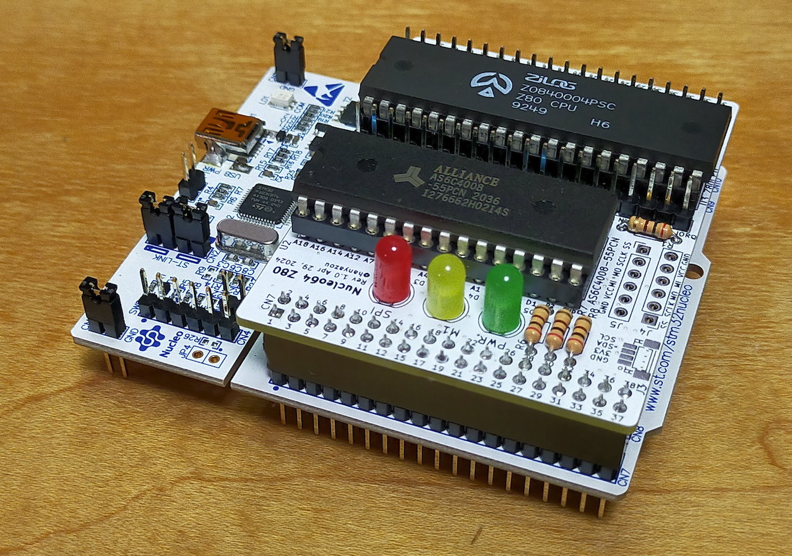
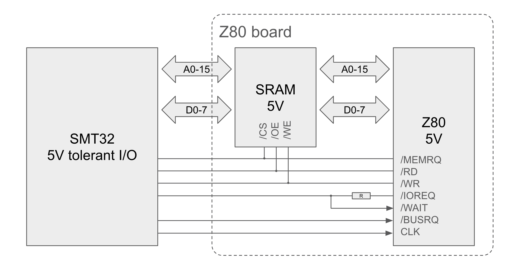
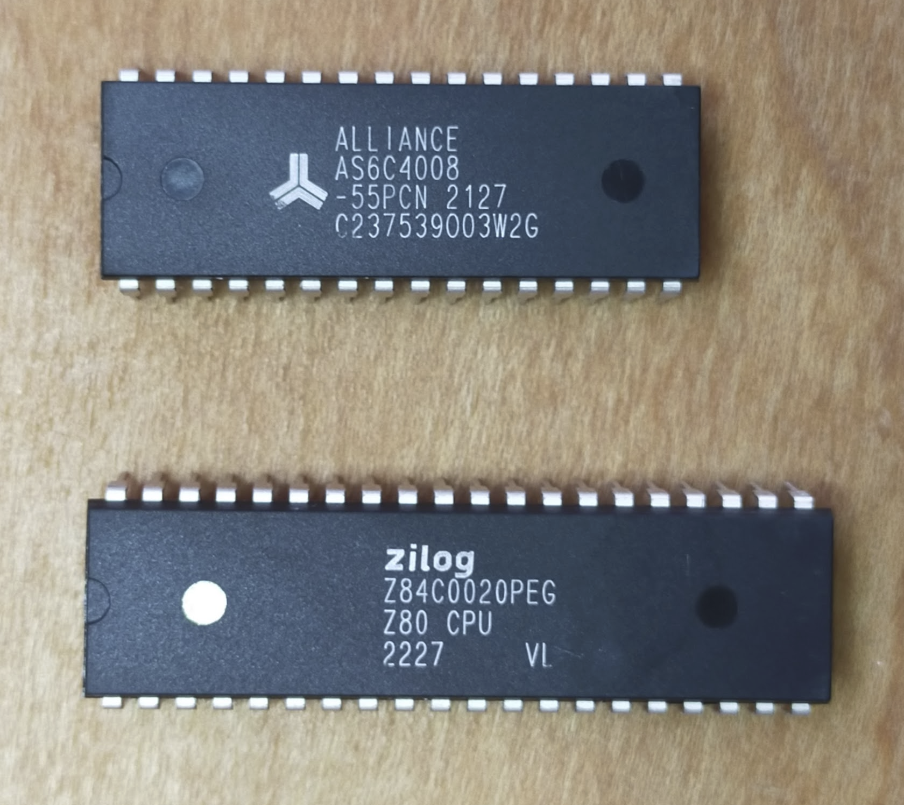
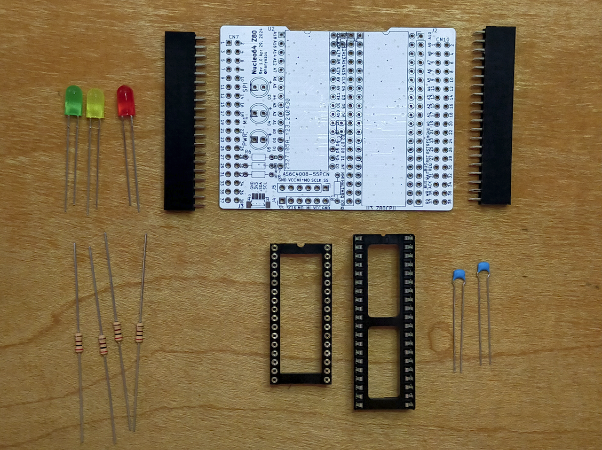
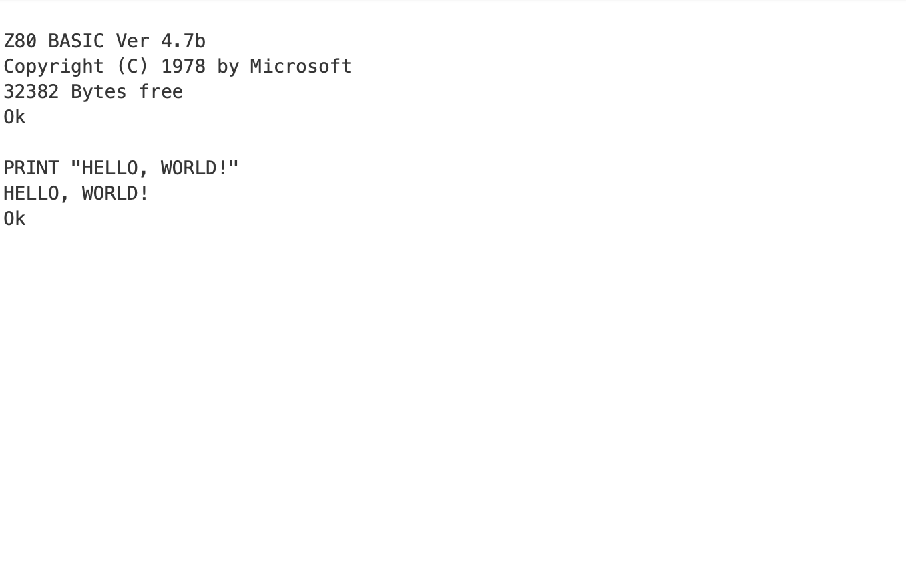
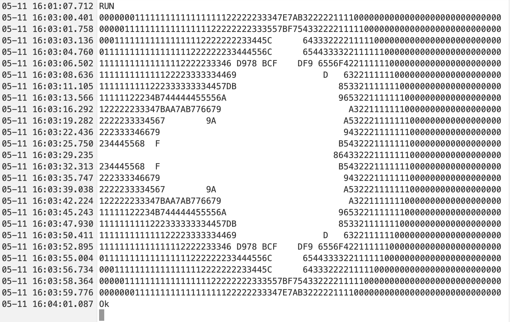
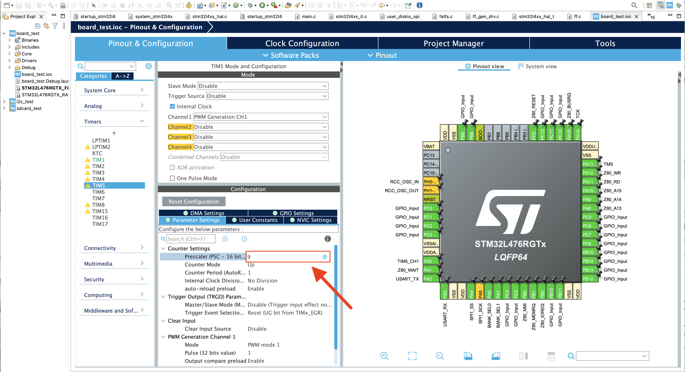

# Nucleo64 Z80

Nucleo64 Z80 is a Z80 expansion board for the STM32 Nucleo 64 board.
It adds a Z80 CPU and SRAM to the Nucleo.
The Z80's I/O access is handled by the STM32 MCU on the Nucleo.

## Features

- Simple 2-chip configuration with Z80 and SRAM, no additional logic IC needed
- Board test firmware includes Microsoft BASIC
- Faster Z80 CPU execution (clock up to 20MHz)
- I2C and SPI devices can be used with the Z80 (custom firmware required)

The Nucleo64 Z80 is derived from satoshiokue's MEZ80RAM and SuperMEZ80-CPM.

## Appearance

The white boards in the following pictures are the Nucleo64 Z80.

## Block Diagram

## Required Components

### ICs

- U3 Z80 (DIP 40 pin) *1
- U2 AS6C4008-55 SRAM 4Mbit (DIP 32 pin) *2

### Through-hole Components

- U3 IC socket (DIP 40 pin)
- U2 IC socket (DIP 32 pin)
- C1, C2 Capacitors 0.1uF
- R1 Resistor 200 ohms
- J4, J5 Pin headers (0.1" pitch 19x2 pin)
- D3, D4, D5 LEDs
- R6, R7, R8 Resistors 100 ohms 1/4W (resistor value may vary depending on the LED)

### Optional Components

- J3 SH 1.0 JST 4 pin connector *3
- J4, J5 Pin sockets (0.1" pitch 6x1 pin) *4

*1) Z80C0004 (4MHz) or higher recommended  
*2) 512Kbit (64KB) might be sufficient  
*3) For I2C Qwiic devices  
*4) For the micro SD card slot, use the one for ARM Arduino as shown on the following page:  
https://www.amazon.com/dp/B0B7WZQVHS

## Build Instructions

With fewer components, assembly is straightforward.
Solder all components except the 19x2 pin headers first, then solder the pin headers last.

## Board Test Firmware

The `FW/board_test` folder contains a test firmware project for STM32 CubeIDE.
The current target is STM32 Nucleo-64 STM32L476RG.

This firmware includes Microsoft BASIC.
When the Z80 runs at 20 MHz, executing ASCIIARTM.BAS takes 61 seconds.

The Z80 clock is generated by TIM5 in the STM32 L476RG.
The prescaler of TIM5 is set to 10 - 1, so the Z80 runs at 4 MHz, which is 1/20 of the system clock (80 MHz).
If you change the prescaler to 1, the clock will be 20 MHz.

## References

### SuperMEZ80-CPM

https://github.com/hanyazou/SuperMEZ80-CPM

### EMUZ80

https://vintagechips.wordpress.com/2022/03/05/emuz80_reference/

### MEZ80RAM

https://github.com/satoshiokue/MEZ80RAM

### NUCLEO-L476RG

https://www.st.com/en/evaluation-tools/nucleo-l476rg.html
